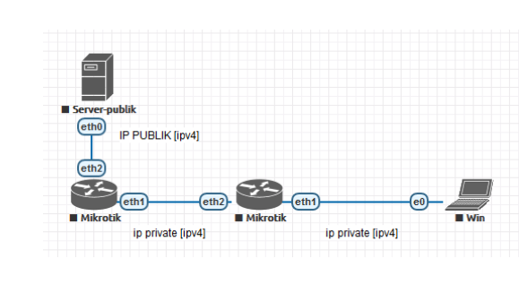

# LAB-7-IP-Publik-vs-IP-Private
tanggal 13 agustus 2025

# IP Publik vs IP Private
# Siswa mampu memahami perbedaan IP Publik dan IP private:
  IP publik dan IP privat adalah dua jenis alamat IP yang berbeda dengan fungsi dan cakupan yang berbeda.  
  IP publik digunakan untuk mengidentifikasi perangkat di internet dan memungkinkan komunikasi global,  
  sementara IP privat digunakan di dalam jaringan lokal (seperti jaringan rumah atau kantor)  
  untuk memungkinkan perangkat berkomunikasi satu sama lain tanpa terhubung langsung ke internet. 

# Tuliskan range ip private IPv4, :
  Kelas IP	Rentang IP Privat  
  Class A	10.0.0.0 – 10.255.255.255  
  Class B	172.16.0.0 – 172.31.255.255  
  Class C	192.168.0.0 – 192.168.255.255

# Kriteria dari IP Publik :
  Kriteria	Penjelasan:
  1. Unik secara global	Setiap IP publik tidak boleh sama di seluruh dunia.
  2. Dapat diakses dari internet.	
  3. IP publik biasanya diberikan oleh Internet Service Provider (ISP).
  4. Tidak termasuk dalam blok IP private.
  5. Diperlukan untuk komunikasi langsung.

# IP Reserved
  IP Reserved adalah rentang alamat IP yang dicadangkan untuk tujuan khusus oleh IANA (Internet Assigned Numbers Authority).  
  Alamat-alamat ini tidak digunakan untuk komunikasi internet biasa, tetapi untuk fungsi tertentu:   
  127.0.0.0/8 - Loopback (komunikasi internal perangkat)  
  169.254.0.0/16 - APIPA (alamat otomatis jika DHCP gagal)  
  224.0.0.0 - 239.255.255.255 → Multicast (pengiriman data ke banyak host sekaligus)  
  240.0.0.0 - 255.255.255.254 → Experimental (uji coba protokol)  
  0.0.0.0 - Default address (tidak ada alamat IP tertentu)  
  255.255.255.255 - Broadcast (siaran ke semua host dalam subnet)  

  Apa 0.0.0.0 dan 0.0.0.0/0 itu berbeda?
  0.0.0.0 artinya tidak ada alamat IP tertentu. Sedangkan 0.0.0.0/0 adalah   
  CIDR notation yang artinya semua alamat IPv4 yang ada.  

# kesimpulan 
ip publik adalah alamat ip yang bisa di akes dari internet mana sajah,  
sedangkan ip privat hanya untuk jangkawan tertentu/local dan biasanya  
tidak bisa terkoneksi langsung ke internet. 
 

